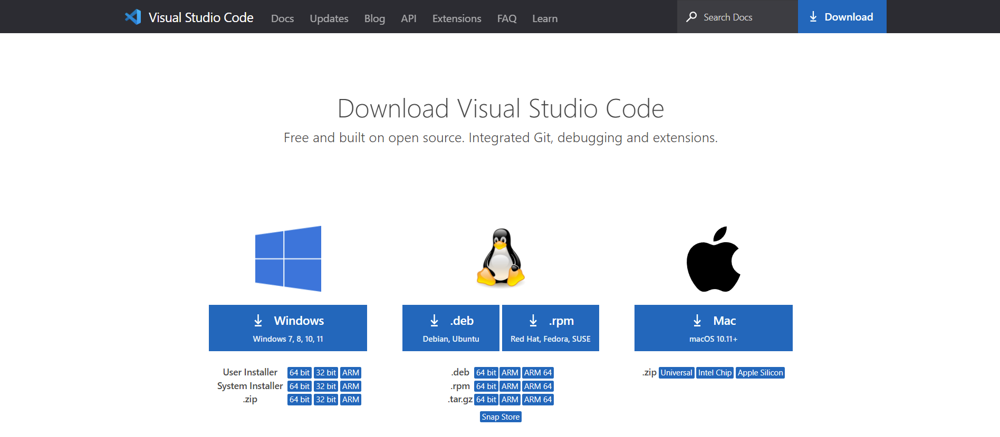
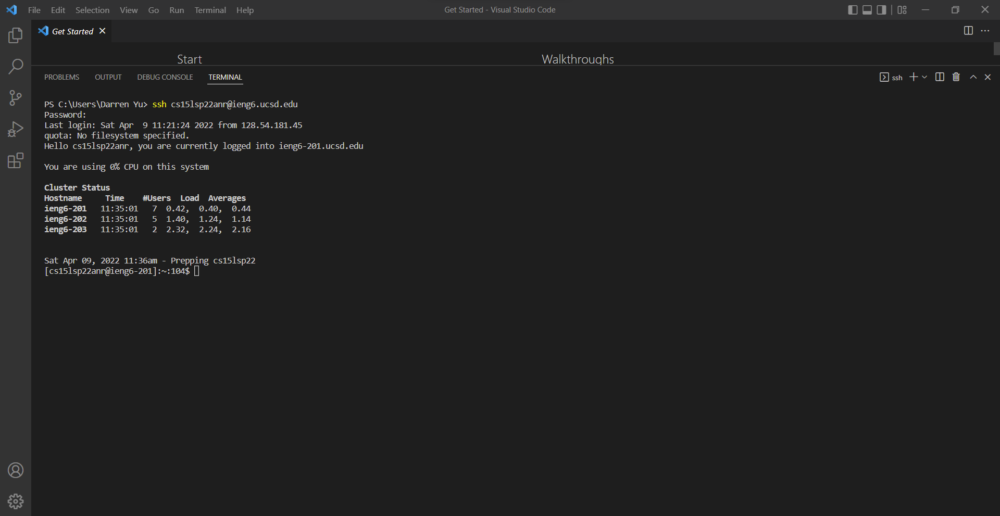
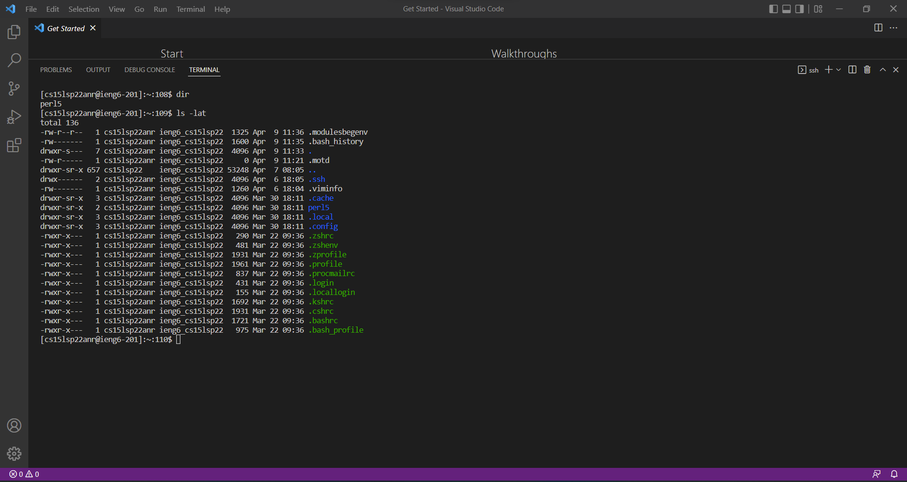
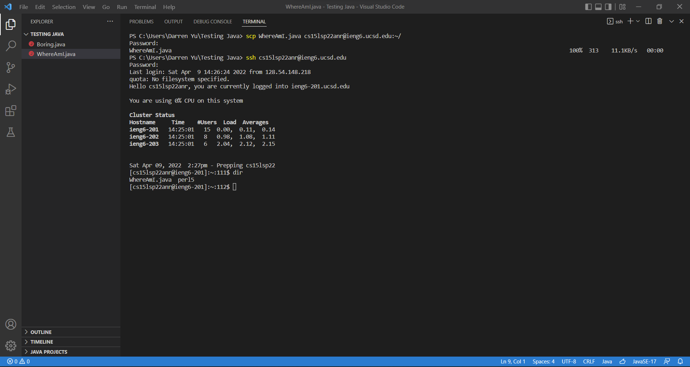
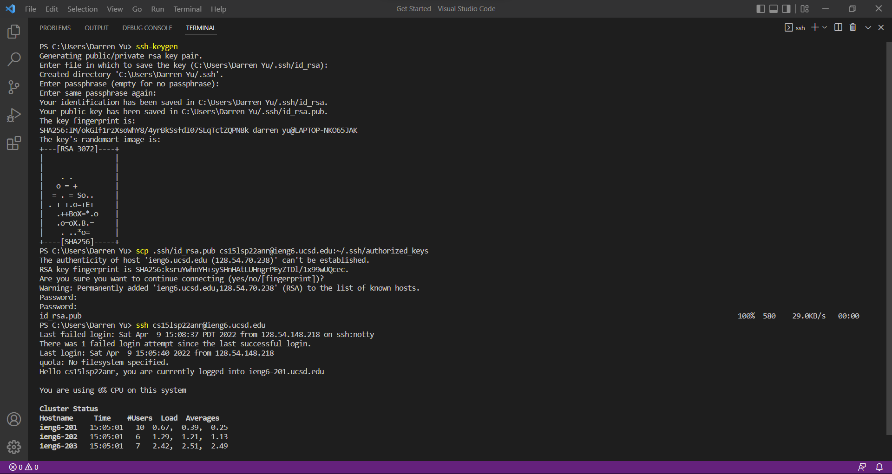
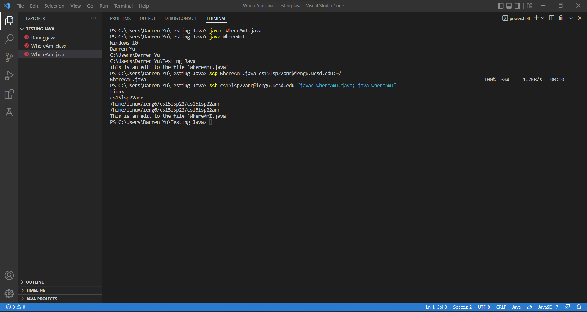

**Installing VScode**



First, go to the installation page for [VS Code](https://code.visualstudio.com/download). Then download the correct operating system version for your computer. After the setup is done downloading, run it so the engine can install VS code.

---
**Remotely Connecting**



After VS Code is done installing, let's connect to the ieng6 server remotely through **ssh**. First, open VS Code and open up a terminal. Second, type "ssh cs15lsp22zz@ieng6.ucsd.edu" into the terminal. The account above is an example account; make sure to replace that account with your account. Third, enter your account password to log in. Note that your password won't type out for security purposes.

---
**Trying Some Commands**



Once you're in the remote servers, let's run some commands. Trying entering the command "dir" into the terminal. This command shows all the files in the default directory. Next, try the command "ls -lat" and see what happens.

---
**Moving Files with scp**



Now that we know how to access the servers remotely: let's upload a file to the directory of your server account. Let's say you have the java file "WhereAmI.java" and want to move this file to the server.

```
class WhereAmI {
  public static void main(String[] args) {
    System.out.println(System.getProperty("os.name"));
    System.out.println(System.getProperty("user.name"));
    System.out.println(System.getProperty("user.home"));
    System.out.println(System.getProperty("user.dir"));
  }

}
```

Assuming you're in a fresh terminal, enter the command "scp WhereAmI.java cs15lsp22zz@ieng6.ucsd.edu:~/" with your account instead. After you run this command, you will be required to enter your server password. Once you're done uploading your file, log into the server and check if your directory has the new file.

---
**Setting an SSH Key**



The process of logging in and uploading files is very tedious. To skip inputting your password every time you log in or scp files, you can create a keygen. First, open a new terminal and enter "ssh-keygen". Keep pressing enter until a random art image is generated. Then, use the command "scp .ssh/id_rsa.pub cs15lsp22zz@ieng6.ucsd.edu:~/.ssh/authorized_keys" with your account. After putting in your password one last time, try logging into the server. You'll see you no longer need to enter your password.

---
**Optimizing Remote Running**



Let's assume you made an edit to a file and want to copy it to the server, compile it, and then run it. With keygen, you save a lot of time, but you can save even more time with the following steps:

1. Assuming you already compiled and ran the file locally, you first need to "scp" the new file like normal.
2. Once your file has been added to your server directory, ssh into your server account and add commands at the end of the login.
3. You separate commands with a semicolon.
4. Adding quotes runs the commands and then exits the server, which is convenient assuming you only wanted to check if the uploaded file works.

---
