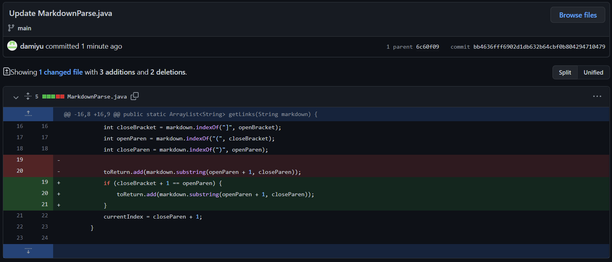

# Lab Report #2 Weeks 2-4

## First Test File

**Changes Made**

**Link to "test-file2.md"**

[Test File #2](https://github.com/damiyu/markdown-parser/blob/main/test-file2.md)

**Error**

The output should've been "[https://www.chess.com/home, https://www.desmos.com/calculator]"

The failure-inducing input of this bug was "test-file2.md". The symptom of the bug was that the output had an extra unexpected link. The bug for this file was that an unpaired set of parenthesis caused the program to count the contents within these parentheses as a link.

## Bug 2

**Error**

The output should've been "[https://canvas.ucsd.edu]"

**Link to "test-file3.md"**

[Test File #3](https://github.com/damiyu/markdown-parser/blob/main/test-file3.md)

## Bug 3

**Error**

The output should've been "[https://www.abc123.com, https://www.crunchyroll.com, https://www.youtube.com]"

**Link to "test-file4.md"**

[Test File #3](https://github.com/damiyu/markdown-parser/blob/main/test-file4.md)
