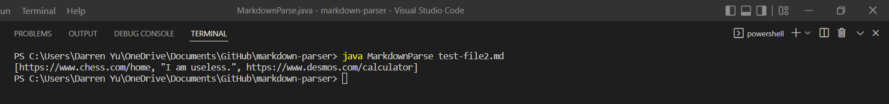

# Lab Report #2 Weeks 2-4

## Bug #1

**Changes Made**

**Link to "test-file2.md"**

[Test File #2](https://github.com/damiyu/markdown-parser/blob/main/test-file2.md)

**Symptom**

The output should've been "[https://www.chess.com/home, https://www.desmos.com/calculator]"

The failure-inducing input for this bug was "test-file2.md". The symptom of the bug was that the output had an extra unexpected link. The bug for this file was that an unpaired set of parenthesis caused the program to count the contents within these parentheses as a link.

## Bug #2

**Changes Made**

**Link to "test-file3.md"**

[Test File #3](https://github.com/damiyu/markdown-parser/blob/main/test-file3.md)

**Symptom**

The output should've been "[https://canvas.ucsd.edu]"

The test file "test-file3.md" was the failure-inducing input for bug #2. The bug for "test-file3.md" was a missing parenthesis to close a second link, which meant the link was faulty. The symptom that lead to bug #2 was a string index out of bounds exception.

## Bug 3

**Changes made**

**Link to "test-file4.md"**

[Test File #4](https://github.com/damiyu/markdown-parser/blob/main/test-file4.md)

**Symptom**

The output should've been "[https://www.abc123.com, https://www.crunchyroll.com, https://www.youtube.com]"

The symptom for this bug was an incomplete output of links. The bug for the failure-inducing input file "test-file4.md" was the program being unable to read brackets inside brackets, which caused the program to think the link was incomplete. Therefore, the program didn't copy the contains of the link.
