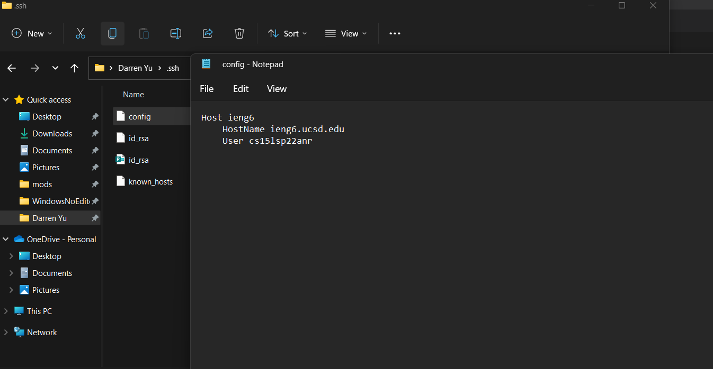
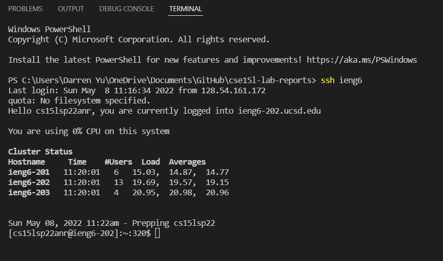
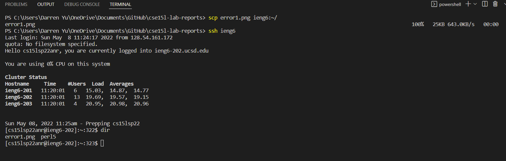
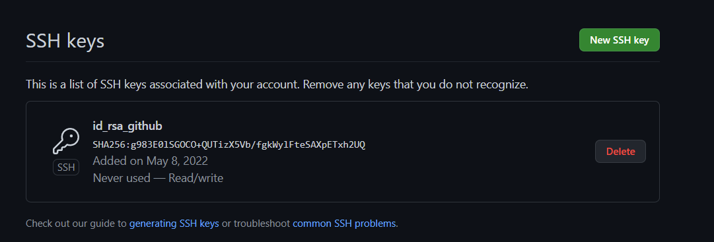
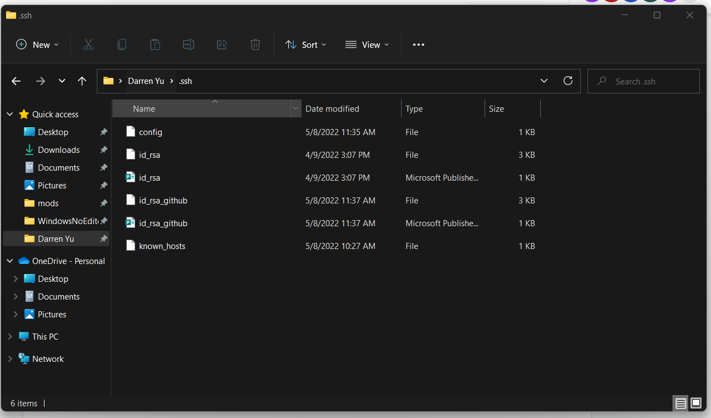
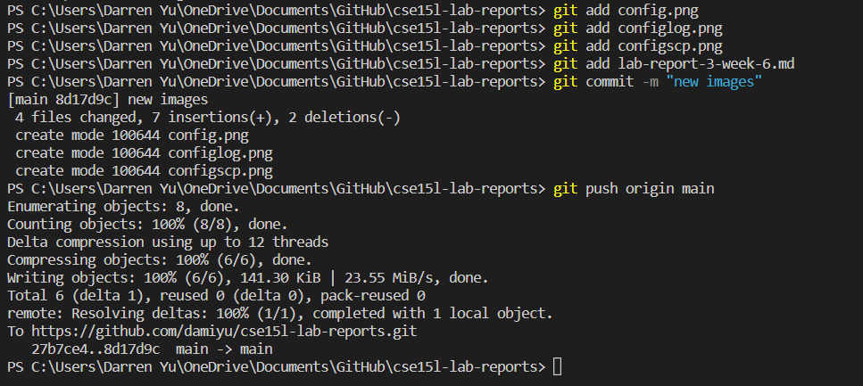
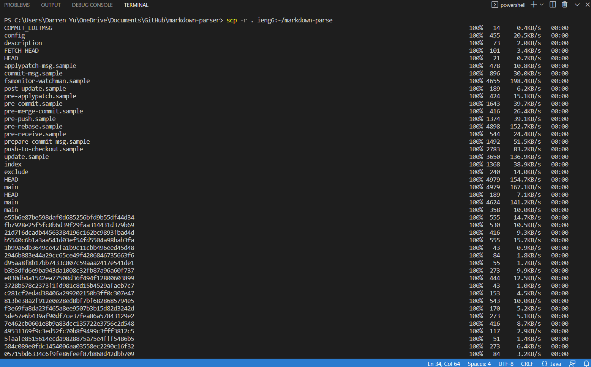
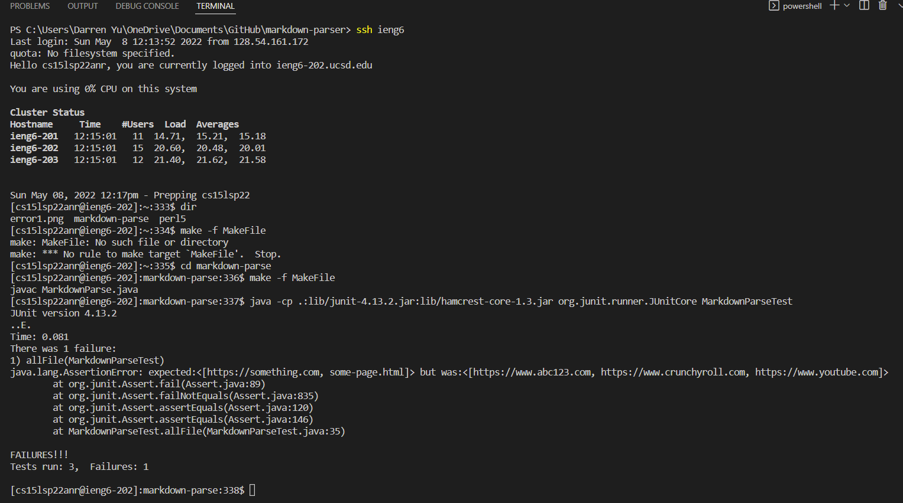
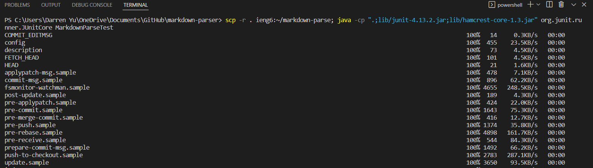
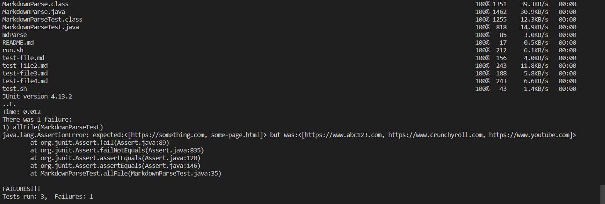

# Lab Report #3 Weeks 5-6

## Streamlining `ssh` Configuration

After creating my config file, I used Window's Notepad to edit this file so I can add my host information.

This is me logging into my remote account.

This is me using the `scp` command to copy a png to remote server.

## Setup Github Access from ieng6

In my Github settings, I added the public key to Github.

In my user account, my Github public and private keys are stored in the .ssh directory.

This is an image of me using the `add`, `commit`, and `push` commands to my Github account.

[Commit Link](https://github.com/damiyu/cse15l-lab-reports/commit/8d17d9c1f4818b866ae9c906e4eb6f02fc1bf426)

## Copy whole directories with `scp -r`

This is the output of the command `scp -r . ieng6:~/markdown-parse`.

This is me logging into my remote account and running the JUnit tests.

I combined the `scp` and `ssh` commands to copy my repository to my remote account and then run the tests.

This is a screenshot of the JUnit tests running after the files are copied.
