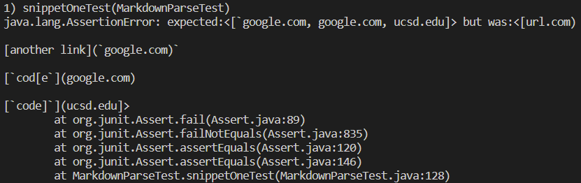

# Lab Report #4 Weeks 7-8

### Repo Links

[Our Markdown Parser](https://github.com/thanhnhanlam/markdown-parser) : [My Copy](https://github.com/damiyu/ourrepo)

[Their Markdown Parser](https://github.com/NuojinliXu/markdown-parser) : [My Copy](https://github.com/damiyu/theirrepo)

### Our Repo Tests

**Snippet 1**

For snippet 1, the correct output for MarkdownParse should be `[google.com, google.com, ucsd.edu]`.

The test:
```
@Test
    public void snippetOneTest() throws IOException {
        Path fileName = Path.of("snippet1.md");
        String content = Files.readString(fileName);
        ArrayList<String> links = MarkdownParse.getLinks(content);

        ArrayList<String> expected = new ArrayList<String>();
        expected.add("`google.com");
        expected.add("google.com");
        expected.add("ucsd.edu");

        assertEquals(expected, links);
    }
```


Our implementation failed the JUnit test for snippet 1.

**Snippet 2**

For snippet 2, the correct output for MarkdownParse should be `[a.com, a.com(()), example.com]`.

**Snippet 3**

For snippet 3, the correct output for MarkdownParse should be `[https://www.twitter.com, https://sites.google.com/eng.ucsd.edu/cse-15l-spring-2022/schedule, https://cse.ucsd.edu/]`.

### Their Repo Tests


### Questions

Do you think there is a small (<10 lines) code change that will make your program work for snippet 1 and all related cases that use inline code with backticks? If yes, describe the code change. If not, describe why it would be a more involved change.

Do you think there is a small (<10 lines) code change that will make your program work for snippet 2 and all related cases that nest parentheses, brackets, and escaped brackets? If yes, describe the code change. If not, describe why it would be a more involved change.

Do you think there is a small (<10 lines) code change that will make your program work for snippet 3 and all related cases that have newlines in brackets and parentheses? If yes, describe the code change. If not, describe why it would be a more involved change.

