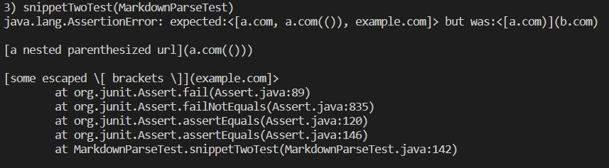
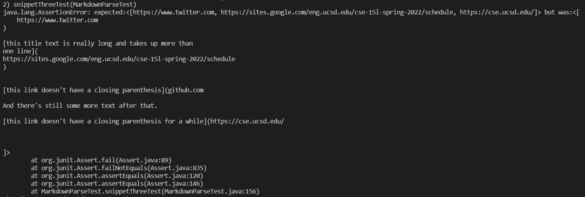
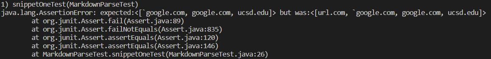
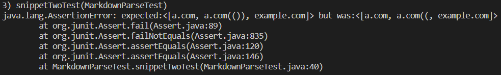
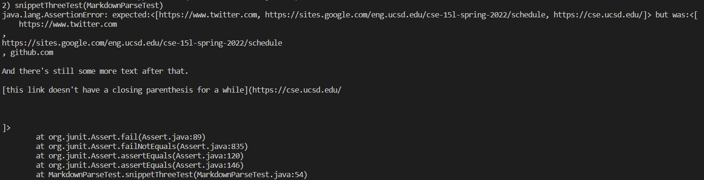

# Lab Report #4 Weeks 7-8

## Repo Links

[Our Markdown Parser](https://github.com/thanhnhanlam/markdown-parser) : [My Copy](https://github.com/damiyu/ourrepo)

[Their Markdown Parser](https://github.com/NuojinliXu/markdown-parser) : [My Copy](https://github.com/damiyu/theirrepo)

## Our Repo Tests

**Snippet 1**

For snippet 1, the correct output for `MarkdownParse.java` should be ``[`google.com, google.com, ucsd.edu]``.

Our Implementation Test 1:
```
    @Test
    public void snippetOneTest() throws IOException {
        Path fileName = Path.of("snippet1.md");
        String content = Files.readString(fileName);
        ArrayList<String> links = MarkdownParse.getLinks(content);

        ArrayList<String> expected = new ArrayList<String>();
        expected.add("`google.com");
        expected.add("google.com");
        expected.add("ucsd.edu");

        assertEquals(expected, links);
    }
```


Our implementation failed the JUnit test for snippet 1.

**Snippet 2**

For snippet 2, the correct output for `MarkdownParse.java` should be `[a.com, a.com(()), example.com]`.

Our Implementation Test 2:
```
    @Test
    public void snippetTwoTest() throws IOException {
        Path fileName = Path.of("snippet2.md");
        String content = Files.readString(fileName);
        ArrayList<String> links = MarkdownParse.getLinks(content);

        ArrayList<String> expected = new ArrayList<String>();
        expected.add("a.com");
        expected.add("a.com(())");
        expected.add("example.com");

        assertEquals(expected, links);
    }
```


Our implementation failed the JUnit test for snippet 2.

**Snippet 3**

For snippet 3, the correct output for `MarkdownParse.java` should be `[https://www.twitter.com, https://sites.google.com/eng.ucsd.edu/cse-15l-spring-2022/schedule, https://cse.ucsd.edu/]`.

Our Implementation Test 3:
```
    @Test
        public void snippetThreeTest() throws IOException {
        Path fileName = Path.of("snippet3.md");
        String content = Files.readString(fileName);
        ArrayList<String> links = MarkdownParse.getLinks(content);

        ArrayList<String> expected = new ArrayList<String>();
        expected.add("https://www.twitter.com");
        expected.add("https://sites.google.com/eng.ucsd.edu/cse-15l-spring-2022/schedule");
        expected.add("https://cse.ucsd.edu/");

        assertEquals(expected, links);
    }
```



Our implementation failed the JUnit test for snippet 3.

## Their Repo Tests

**Snippet 1**

For snippet 1, the correct output for `MarkdownParse.java` should be `[google.com, google.com, ucsd.edu]`.

Their Implementation Test 1:
```
    @Test
    public void snippetOneTest() throws IOException {
        Path fileName = Path.of("snippet1.md");
        String content = Files.readString(fileName);
        ArrayList<String> links = MarkdownParse.getLinks(content);

        ArrayList<String> expected = new ArrayList<String>();
        expected.add("`google.com");
        expected.add("google.com");
        expected.add("ucsd.edu");

        assertEquals(expected, links);
    }
```


Their implementation failed the JUnit test for snippet 1.

**Snippet 2**

For snippet 2, the correct output for `MarkdownParse.java` should be `[a.com, a.com(()), example.com]`.

Their Implementation Test 2:
```
    @Test
    public void snippetTwoTest() throws IOException {
        Path fileName = Path.of("snippet2.md");
        String content = Files.readString(fileName);
        ArrayList<String> links = MarkdownParse.getLinks(content);

        ArrayList<String> expected = new ArrayList<String>();
        expected.add("a.com");
        expected.add("a.com(())");
        expected.add("example.com");

        assertEquals(expected, links);
    }
```


Their implementation failed the JUnit test for snippet 2.

**Snippet 3**

For snippet 3, the correct output for `MarkdownParse.java` should be `[https://www.twitter.com, https://sites.google.com/eng.ucsd.edu/cse-15l-spring-2022/schedule, https://cse.ucsd.edu/]`.

Their Implementation Test 3:
```
    @Test
    public void snippetThreeTest() throws IOException {
        Path fileName = Path.of("snippet3.md");
        String content = Files.readString(fileName);
        ArrayList<String> links = MarkdownParse.getLinks(content);

        ArrayList<String> expected = new ArrayList<String>();
        expected.add("https://www.twitter.com");
        expected.add("https://sites.google.com/eng.ucsd.edu/cse-15l-spring-2022/schedule");
        expected.add("https://cse.ucsd.edu/");

        assertEquals(expected, links);
    }
```



Their implementation failed the JUnit test for snippet 3.

## Questions

1) Do you think there is a small (<10 lines) code change that will make your program work for snippet 1 and all related cases that use inline code with backticks? If yes, describe the code change. If not, describe why it would be a more involved change.

I think if we add a small if/else statement into our implementation, we should be able to filter through backticks. We can compare the positions of the backticks, brackets, and parenthesis to determine if the backticks are used as inline code or part of the title of the link or part of the url.

2) Do you think there is a small (<10 lines) code change that will make your program work for snippet 2 and all related cases that nest parentheses, brackets, and escaped brackets? If yes, describe the code change. If not, describe why it would be a more involved change.

I don't think a small code edit would solve the issue with snippet 2. I would need to make a helper method to help us figure out which parentheses and brackets are paired up, which would definitely take more than 10 lines.

3) Do you think there is a small (<10 lines) code change that will make your program work for snippet 3 and all related cases that have newlines in brackets and parentheses? If yes, describe the code change. If not, describe why it would be a more involved change.

I don't think a small code edit would solve the issue with snippet 3 either. This issue would require me to make multiple if/else statements to try to catch new lines and empty spaces.
