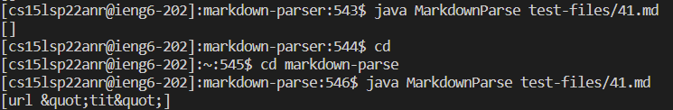
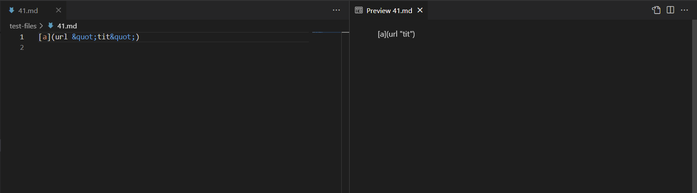
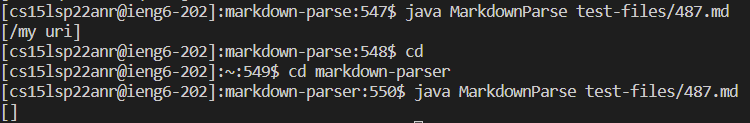
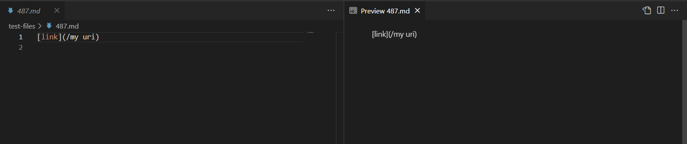

# Lab Report #5 Weeks 9-10

## Found Two Test Files

I found these two files by randomly picking files and manually comparing the parser outputs. After about 10ish comparisons, I found two files that made the two parsers output a different result.

## Two File Links
Link 1: [File 41](https://github.com/nidhidhamnani/markdown-parser/blob/main/test-files/41.md)

Link 2: [File 487](https://github.com/nidhidhamnani/markdown-parser/blob/main/test-files/487.md)

## File 41 Output

My Implementation Output: `[url &quot;tit&quot;]`

Lab 9 Implementation Output: `[]`

Correct Output: `[]`

Using VScode preview, I can see the correct output should be no links. Therefore, my implementation was incorrect and lab 9's implementation was correct. My implementation's parser failed because I did not account for `&quot;`, which puts quotes around a word. To fix this issue, I would add an if statement that checks if `&quot;` is present in the potential link. If `&quot;` is present in the potential link, I would discard that link and my parser would continue searching through the file.

## File 487 Output

My Implementation Output: `[/my uri]`

Lab 9 Implementation Output: `[]`

Correct Output: `[]`

Using VScode preview, I can see the correct output should be no links. Therefore, lab 9's implementation was correct and my implementation was incorrect. My implementation's parser failed because I didn't know spaces in a link would make the link invalid. I would simply add a new variable that stores the index of the next space. Using this index, I would compare it with the closed parenthesis index. If the space index is less than the closed parenthesis index, I would ignore this faulty link and continue my parser.
